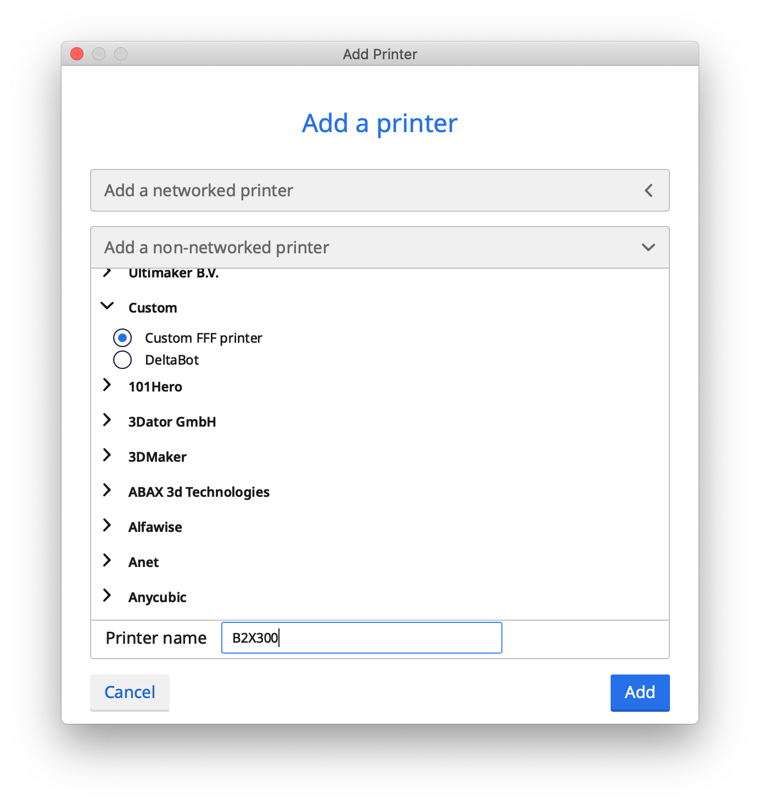
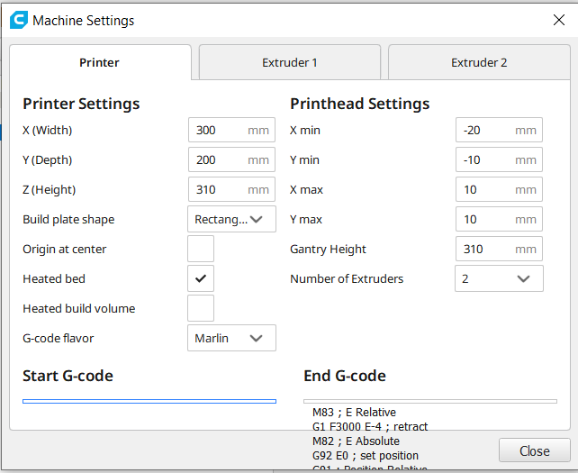

# B2X300 Profiles - Important Notice

The profile file available here (`BEEVERYCREATIVE_B2X300_v1.2.3mf`) is only compatible with older versions of Cura (only for Cura 3.x) and is the only supported profile.

You might also want to try to setup a printer profile for Cura 4.x but bear in mind that this is not supported by BEEVERYCREATIVE's customer support. Proceed at your own risk.

## Cura 4 Profile

Since version Cura 4.0 it is not possible to import a project file to quickly setup your B2X300 printer profile. Because of this, you have to manually set up your B2X300 printer. Follow the steps below to learn how to do it:

1. Install the desired version of Cura (this has been tested on Cura 4.4.1)
2. Open Cura
3. Go to `Settings` > `Printer` > `Add Printer...`
4. On the dialog that showed up press `Add a non-networked printer` > `Custom` > `Custom FFF printer`
5. Enter `B2X300` as the _Printer name_ and press `Add`



A new window will show up. Fill the text boxes with the information below.

### Machine Settings - Printer

**Printer Settings**

- X (Width): `300` mm
- Y (Depth): `200` mm
- Z (Height): `310` mm
- Build Plate shape: `Rectangle`
- Origin at center: (unchecked)
- Heated bed: (checked)
- Heated build volume: (unchecked)
- G-code Flavor: `Marlin`
  
**Printhead Settings**

- X min: `-20` mm
- Y min: `-10` mm
- X max: `10` mm
- Y max: `10` mm
- Gantry Height: `310` mm
- Number of Extruders: `2`

You should have something like the image below. Don't forget to fill in the Start and End G-code sections that are present after the image.




**Start G-code**: copy and paste the following lines (remove existing text, if any):

```
;B2X300 machine settings
G90 ; use absolute coordinates octolapse
M906 X800 Y800 Z925 E1100 ; Stepper driver current
M916 E1 Z0 ; Stepper driver mode
M203 X200 Y200 Z6 E60 ; MAX feedrate
M201 X3000 Y3000 E10000 Z200 ; MAX acceleration
M205 X8 Y8 Z0.4 E2.5 ; Jerk settings
M204 P500 T750 ; acceleration speed

M104 S0 T0
M104 S0 T1
M104 S160
M140 S{material_bed_temperature}
M117 Heating Bed...
G28 ; Home
M190 S{material_bed_temperature}
M117 Stabilizing Bed Temp
G4 S60
M117 Level bed...
G29 ; finding mesh
M420 S1
M900 K180 ; K-Factor PLA
G1 X296 Z1 F1200
G92 E0
M117 Heating Extruder...
M109 S{material_print_temperature}
M117 Prime line...
G1 Z0.4 F1200 ; move to layer height
G1 Y50 E20 F360 ; prime nozzle
G92 E0
M201 Z50
M77 ; Stop heat up timer
M75 ; Start print timer
M117 Printing...
```

**End G-code**: copy and paste the following lines (remove existing text, if any):

```
M83 ; E Relative
G1 F3000 E-4 ; retract
M82 ; E Absolute
G92 E0 ; set position
G91 ; Position Relative
G1 F1200 Z2 ; Z up
G90 ; Position Absolut
M104 T0 S0 ; turn off Ext1 temperature
M104 T1 S0 ; turn off Ext2 temperature
M140 S0 ; turn off Bed temperature
G1 X150 Y200 ; home X axis and push y to the front
M84 ; disable motors
M300 P(10) S(16) ; finished beep
M117 Finished!
M201 X3000 Y3000 E10000 Z200 ; Reset default MAX acceleration
```


### Machine Settings - Extruder 1

**Nozzle Settings**

- Nozzle size: `0.4` mm
- Compatible material diameter: `1.75` mm
- Nozzle offset X: `0` mm
- Nozzle offset Y: `0` mm
- Cooling Fan Number: `0`

**Extruder Start G-Code** - copy and paste the following lines in the text box:

```
M109 S{material_initial_print_temperature}
```

**Extruder End G-Code** - copy and paste the following lines in the text box:

```
M104 S{material_standby_temperature} ; standby temperature
G0 F3600 X258.5 Y152 ; move extruder
```

### Machine Settings - Extruder 2

**Nozzle Settings**

- Nozzle size: `0.4` mm
- Compatible material diameter: `1.75` mm
- Nozzle offset X: `0` mm
- Nozzle offset Y: `0` mm
- Cooling Fan Number: `0`

**Extruder Start G-Code** - copy and paste the following lines in the text box:

```
M109 S{material_initial_print_temperature}
```

**Extruder End G-Code** - copy and paste the following lines in the text box:

```
M104 S{material_standby_temperature} ; standby temperature
G0 F3600 X237 Y152 ; move extruder
```

## Final Remarks

Don't forget to install the filament profiles available in this repository to get you started quickly.

It should be noted that this are settings that worked for the most recent version of Cura at the time of writing this document. As stated before, BEEVERYCREATIVE is only supporting Cura 3. As Cura gets updated, some settings might need to be modified - we encourage you to tune your printer profile and share it with other B2X300 users on BEEVERYCREATIVE's user forum: http://beeverycreative.com/forum